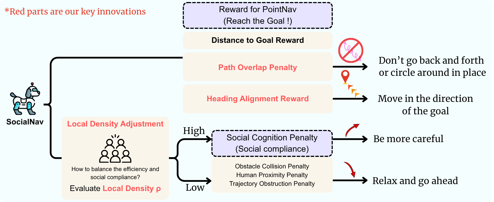
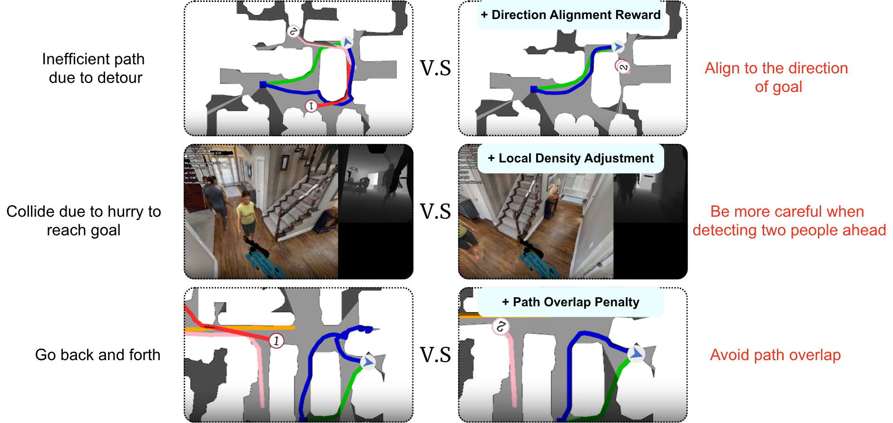

# AIAA 4220 Project 3 — Enhancing FALCON Social Navigation via Reward Shaping: Density Modulation, Path Stability, and Heading Alignment

**Time:** 2025.10-2025.12
**Team:** Ruipeng Yu, Yuhan Chen

Based on the [FALCON](https://github.com/Zeying-Gong/Falcon) framework for SocialNav.
Project guidance: [aiaa4220_hw3](https://github.com/Zeying-Gong/aiaa4220_hw3).(Reference for starting)

---

## Motivation

The original FALCON reward design has two key issues:

1. **Goal vs. social compliance trade-off** — the agent struggles to balance reaching the goal efficiently while respecting human social norms.
2. **Inefficient motion** — the agent frequently oscillates, backtracks, or circles instead of moving decisively toward the goal.

To address these, we propose three reward-shaping innovations:

| # | Module | Purpose |
|---|--------|---------|
| 1 | **Local Density Adjustment** | Adapt social penalties to crowd density — more cautious in dense scenes, relaxed in sparse ones |
| 2 | **Path Overlap Penalty** | Penalize revisiting past positions to suppress oscillation and circling |
| 3 | **Heading Alignment Reward** | Reward facing the goal direction to reduce detours and improve path straightness |

All modifications are implemented in `additional_metric.py` via `MultiAgentNavReward`.



---

## Experimental Results

We conducted an ablation study on the full FALCON model. All models use the same PPO hyperparameters (600k steps, 8 envs).

| Model | Total | SR | SPL | PSC | H-Coll |
|-------|-------|----|-----|-----|--------|
| Baseline (full) | 0.6320 | 0.53 | 0.4880 | 0.9120 | 0.41 |
| + Overlap | 0.6541 | 0.55 | 0.4967 | 0.9413 | 0.41 |
| + Overlap + Density v1 | 0.6459 | 0.55 | 0.4723 | 0.9475 | 0.37 |
| **+ Overlap + Density v2** | **0.6810** | **0.61** | **0.5163** | **0.9403** | **0.35** |
| + Overlap + Density v2 + Direction | 0.6799 | 0.59 | 0.5373 | 0.9425 | 0.39 |
| Extra Data + Overlap + Density v2 | 0.6599 | 0.57 | 0.5018 | 0.9378 | 0.39 |

**Best configuration: + Overlap + Density v2** (Total = 0.6810), achieving the highest SR (0.61) and lowest human collision rate (0.35).

### Key Observations

- **Density v1 hurt SPL** — down-weighting the goal reward in crowded scenes caused the agent to linger. v2 fixes this by keeping goal reward full-weight and only scaling social penalties.
- **Heading alignment improves SPL** — SPL rose from 0.5163 to 0.5373, confirming that a small angular shaping reward produces straighter paths.
- **More data alone isn't enough** — adding training episodes without re-tuning hyperparameters degraded performance (0.6810 → 0.6599).



---

## Reward Structure Overview

`MultiAgentNavReward` defines the overall reward function for multi-agent social navigation tasks. The final reward is a linear combination of the following components at each timestep:

1. **Goal-related Reward**
   - Distance-to-goal reward (always full weight — never modulated by density)
   - Success reward (handled at the task level)

2. **Human-aware Penalties**
   - Density-scaled penalty for being too close to humans
   - Penalty for colliding with humans
   - Penalty for blocking human future trajectories

3. **Scene Collision Penalty**
   - Penalty for collisions with the static environment

4. **Trajectory and Motion Regularization**
   - Path overlap penalty to suppress oscillatory behaviors
   - Heading alignment reward to encourage facing the goal

5. **Density-aware Modulation**
   - Local human density (Gaussian kernel) adaptively scales social penalties and comfort distance

---

## Modified and Newly Added Reward Components

### Density-aware Social Modulation

At each timestep, the robot estimates a **local human density** via a Gaussian kernel over all nearby humans. This density signal is used to:
- Strengthen human-related penalties in crowded scenes
- Dynamically shrink the allowed human–robot comfort distance

Goal distance reward is intentionally left unmodulated — earlier attempts to down-weight it caused hesitant behavior.

### Adaptive `allow_distance` Shrinkage

The original fixed comfort distance is replaced by a density-adaptive version:
- In sparse scenes, the original comfort distance is retained
- In crowded scenes, the effective comfort distance is reduced (bounded by `allow_distance_min`)

### Density-scaled Close-to-Human Penalty

When the robot approaches humans within `facing_human_dis`:
- A base proximity penalty is applied
- The penalty magnitude scales proportionally to local human density

### Path Overlap Penalty

A short history buffer of past robot positions is maintained. If the current position falls within a threshold distance of earlier positions (excluding the most recent few), a penalty is applied. This suppresses spinning, local oscillations, and short-range looping.

### Heading Alignment Reward

A small shaping reward proportional to `−|θ|` (where θ is the angular difference between robot heading and goal direction) encourages the agent to face the goal, reducing unnecessary rotations and lateral drifting.

### Human Future Trajectory Coverage Penalty

Oracle-provided future human trajectories are used to penalize the robot for occupying predicted human paths. Earlier future steps receive higher weight.

---

## Best-performing Reward Configuration

**Overall Score: 0.681**

```yaml
measurements:
  multi_agent_nav_reward:
    type: MultiAgentNavReward
    use_geo_distance: true

    # goal & collision
    collide_scene_penalty: -0.001
    collide_human_penalty: -0.025

    # human-aware
    allow_distance: 2.0
    allow_distance_min: 0.1
    allow_distance_shrink: 0.5
    facing_human_dis: 1.5
    close_to_human_penalty: -0.003

    # density modulation
    density_sigma: 1.0
    density_penalty_beta: 0.5

    # future trajectory
    trajectory_cover_penalty: -0.0005
    cover_future_dis_thre: 0.05

    # path overlap (stability)
    path_overlap_penalty: -0.006
    path_overlap_thre: 0.5
    path_history_len: 50
    path_recent_ignore: 3

    robot_idx: 0
```

<details>
<summary>Training parameters</summary>

```yaml
habitat_baselines:
  evaluate: False
  verbose: True
  trainer_name: "falcon_trainer"
  torch_gpu_id: 0
  tensorboard_dir: "evaluation/falcon/hm3d/tb/1121_full"
  video_dir: "evaluation/falcon/hm3d/video/1121_full"
  test_episode_count: -1
  num_environments: 8
  checkpoint_folder: "evaluation/falcon/hm3d/checkpoints/1121_full"
  num_updates: -1
  total_num_steps: 600000
  log_interval: 10
  num_checkpoints: 100
  force_torch_single_threaded: True
  load_resume_state_config: False

  rl:
    ppo:
      clip_param: 0.2
      ppo_epoch: 2
      num_mini_batch: 2
      value_loss_coef: 0.5
      entropy_coef: 0.01
      lr: 2.5e-4
      eps: 1e-5
      max_grad_norm: 0.2
      num_steps: 128
      use_gae: True
      gamma: 0.992
      tau: 0.95
      use_linear_clip_decay: False
      use_linear_lr_decay: False
      reward_window_size: 50
```
</details>

---

## How to Run Training

```bash
python -u -m habitat_baselines.habitat_baselines.run \
  --config-name=social_nav_v2/falcon_hm3d_train_11_21.yaml
```

---

## Key Findings

1. **Reward balance matters.** Density v1 shows that even a reasonable social-awareness signal can harm overall performance if it weakens the distance-to-goal incentive. Effective shaping must preserve forward motivation.

2. **Local density is a powerful signal for social compliance.** Density v2 demonstrates that modulating human-related penalties — rather than goal rewards — produces a socially compliant yet efficient agent.

3. **Motion style can be shaped by lightweight rewards.** The overlap penalty eliminates oscillation, and the heading alignment reward improves path straightness. These small, interpretable shaping terms significantly influence navigation smoothness.

4. **Social awareness does not imply hesitation.** With proper reward design, an agent can remain polite in crowded environments while decisively advancing toward its goal.

---

## Files

| File | Purpose |
|------|---------|
| `additional_metric.py` | `MultiAgentNavReward` — our improved reward function with all three innovations |
| `falcon_hm3d_train_11_21.yaml` | Training configuration with best-performing hyperparameters |
